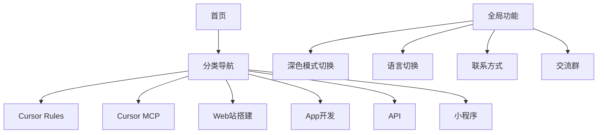

# CursorFun.com 项目架构文档

## 项目概览
CursorFun.com 是一个专注于 Cursor IDE 相关资源的导航网站，采用 Next.js + TailwindCSS 构建。

## 技术栈
- Next.js 14
- TypeScript
- TailwindCSS
- i18n (国际化)
- next-themes (深色模式)

## 目录结构
```
src/
├── app/                    # App Router 目录
│   ├── [locale]/          # 国际化路由
│   └── api/               # API 路由
├── components/            # 可复用组件
│   ├── layout/           # 布局组件
│   └── ui/               # UI 组件
├── lib/                   # 工具函数
├── styles/               # 全局样式
└── types/                # TypeScript 类型定义
```

## 核心功能模块


## 页面组件依赖关系
- Layout
  - Header (导航栏)
  - Sidebar (分类菜单)
  - Footer (页脚信息)
- 功能组件
  - ThemeToggle (深色模式切换)
  - LanguageSwitch (语言切换)
  - ContactFloat (悬浮联系方式)
  - QRCodeModal (群二维码弹窗)

## 开发进度
- [ ] 项目初始化
- [ ] 基础布局搭建
- [ ] 深色模式实现
- [ ] 国际化支持
- [ ] 分类导航实现
- [ ] 响应式适配
- [ ] 联系方式集成
- [ ] 部署上线

## 关键文件索引
- `src/app/layout.tsx`: 根布局文件
- `src/app/page.tsx`: 首页组件
- `src/components/layout/Header.tsx`: 顶部导航
- `src/components/ui/ThemeToggle.tsx`: 主题切换
- `src/lib/i18n.ts`: 国际化配置 