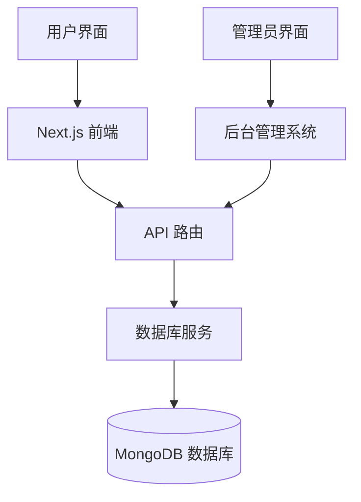
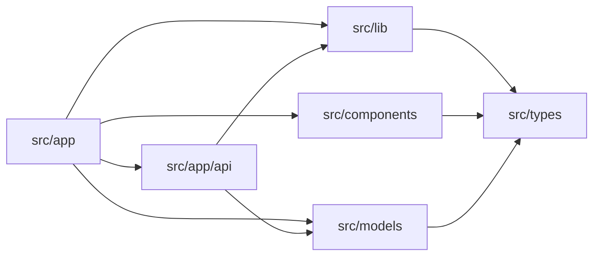
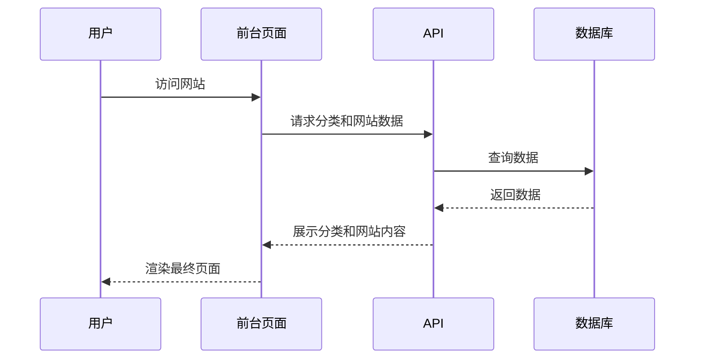
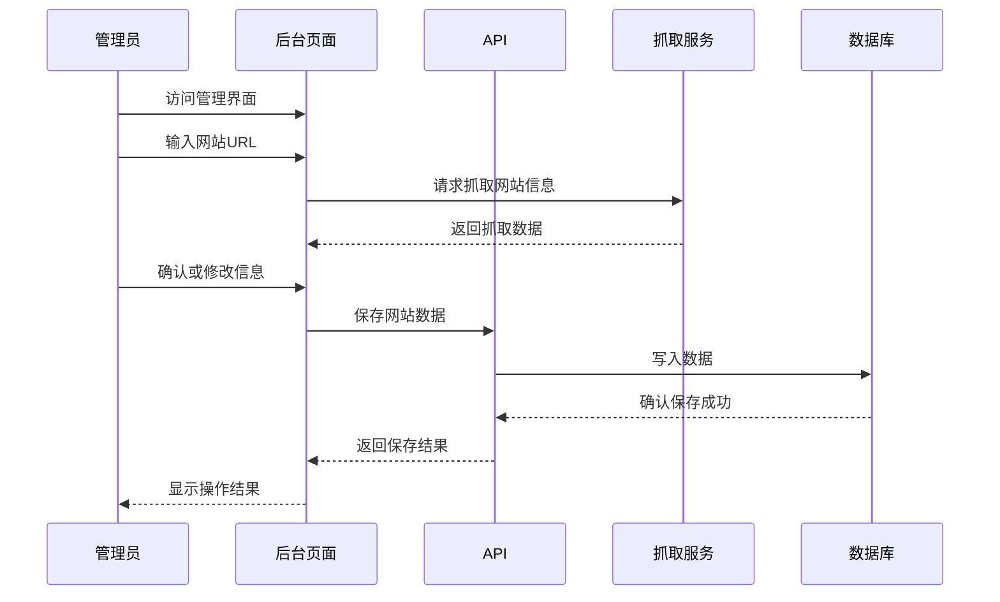

# CursorFun 资源导航与后台管理系统

CursorFun 是一个专注于收集和展示 Cursor 编辑器相关资源的网站，包括前台资源展示和后台管理系统。

## 项目架构概览

### 技术栈

- **前端框架**: Next.js 15.2.4 
- **UI 库**: React 19, TailwindCSS
- **数据库**: MongoDB, Mongoose
- **图标**: Lucide React, React Icons
- **动画**: Framer Motion
- **主题**: Next Themes (深色/浅色模式)

## 代码文件依赖关系

## 功能模块调用逻辑

### 前台展示流程

### 后台管理流程

## 关键代码文件定位索引

### 数据模型

- `src/models/Category.ts`: 分类数据模型
- `src/models/Website.ts`: 网站数据模型
- `src/types/index.ts`: TypeScript 类型定义

### API 端点

- `src/app/api/categories/route.ts`: 分类管理 API
- `src/app/api/websites/route.ts`: 网站管理 API
- `src/app/api/scrape/route.ts`: 网站信息抓取 API

### 后台管理界面

- `src/app/admin/page.tsx`: 仪表盘
- `src/app/admin/categories/page.tsx`: 分类管理
- `src/app/admin/websites/page.tsx`: 网站管理
- `src/components/admin/AdminLayout.tsx`: 管理界面布局
- `src/components/admin/WebsiteForm.tsx`: 网站表单组件
- `src/components/admin/CategoryForm.tsx`: 分类表单组件

### 工具库

- `src/lib/db.ts`: 数据库连接
- `src/lib/scraper.ts`: 网站自动抓取工具
- `src/lib/data.ts`: 静态数据(开发用)

## 项目进度

- [x] 基础项目架构搭建
- [x] 前台页面开发
- [x] 后台管理系统框架
- [x] 数据库模型设计
- [x] API 端点实现
- [x] 分类管理功能
- [x] 网站管理功能
- [x] 网站自动抓取功能
- [ ] 用户认证功能
- [ ] 数据统计分析
- [ ] SEO 优化

## 如何开始

1. 克隆项目仓库
2. 安装依赖：`npm install`
3. 创建 `.env.local` 文件并配置 MongoDB 连接
4. 启动开发服务器：`npm run dev`
5. 访问：`http://localhost:3000`

## 部署说明

推荐使用 Vercel 一键部署：

1. 在 Vercel 导入 GitHub 仓库
2. 配置环境变量 `MONGODB_URI`
3. 部署项目

## 开发者信息

- GitHub: [328599138](https://github.com/328599138)
- 微信: fengakon
- 邮箱: 328599138@qq.com
